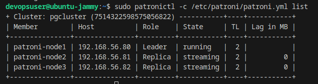
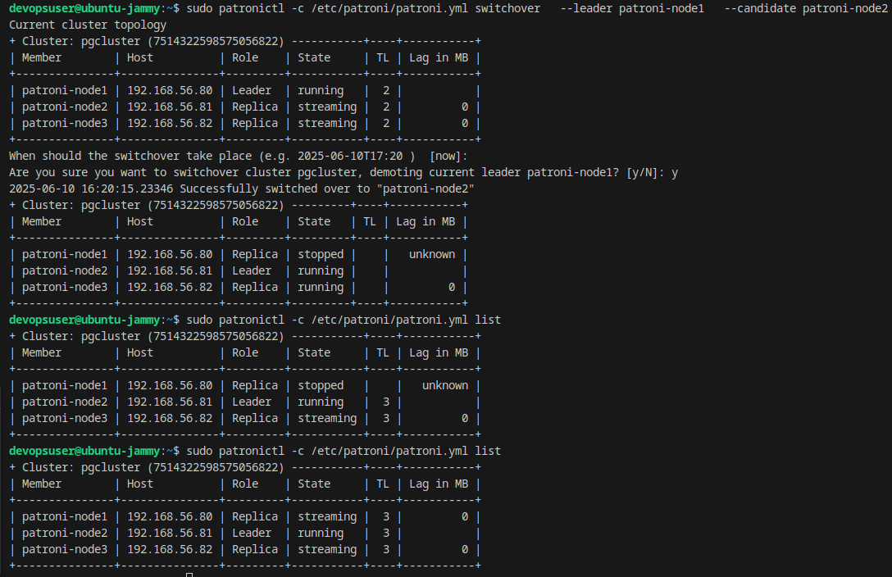
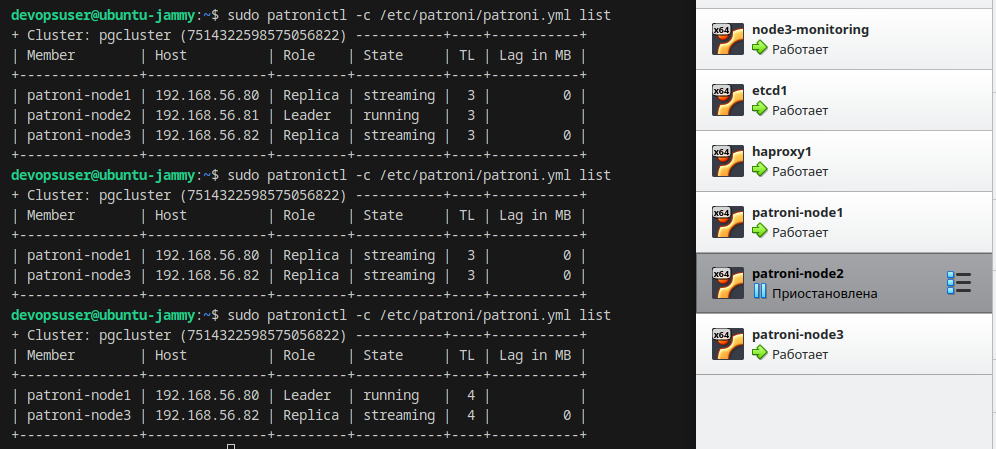
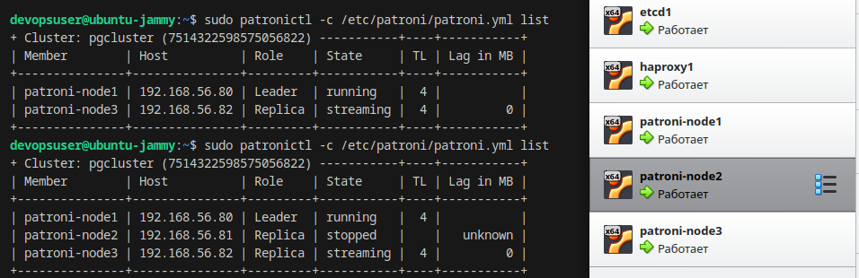
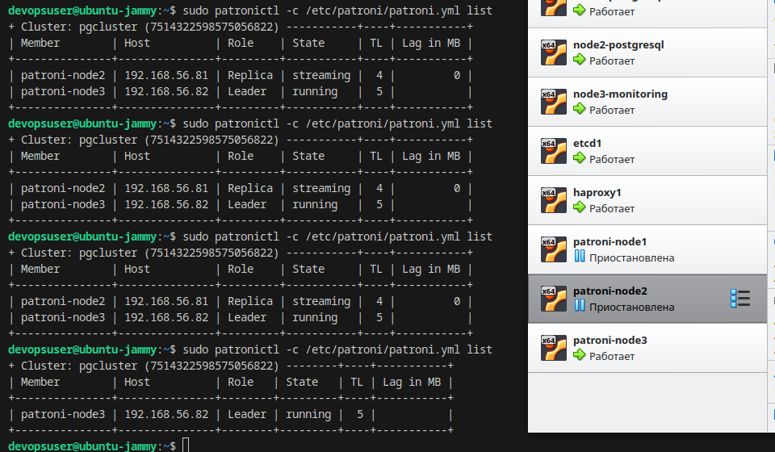
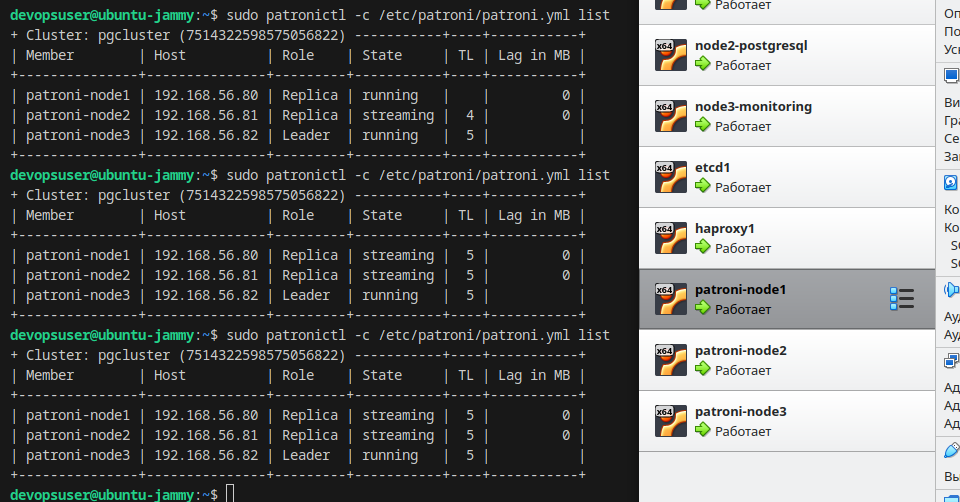
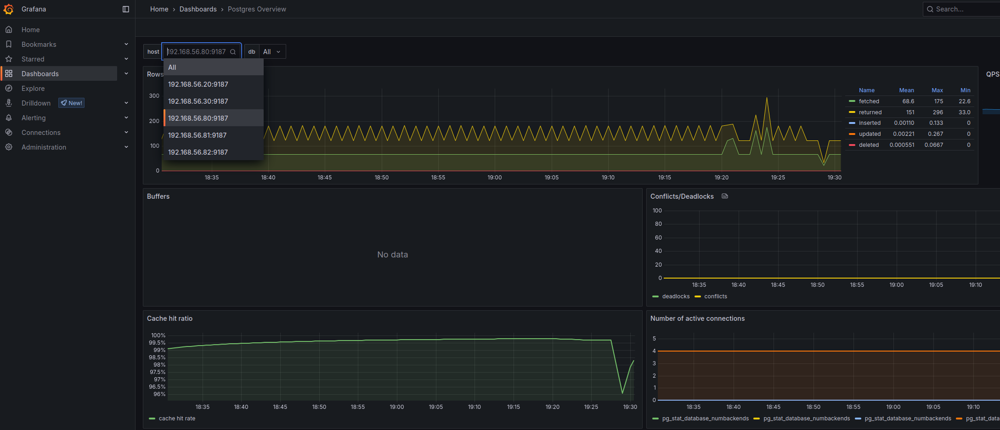

# IFMO_DistributedComputing_for_DevOps
Distributed Computing course for DevOps 2025

# Лабораторная работа №1
# Студент: Денис Бурцев

На удаленном сервере разворачивает через github actions / ansible экземпляр CMS Directus.

Directus доступен по адресу: http://130.193.36.192:8055/admin/login

Admin email: "admin@example.com"
Admin password: "d1r3ctu5"

Альтернатива в виде Directus выбрана в связи с тем, что у wordpress отсутствует поддержка PostgreSQL.

# Лабораторная работа №2
# Студент: Денис Бурцев

Проведен рефакторинг, ключевые изменения: запуск осуществляется на локальной машине, для запуска необходимо установить:

- [VirtualBox](https://www.virtualbox.org/wiki/Downloads)
- [Vagrant](https://developer.hashicorp.com/vagrant/downloads)
- [Ansible](https://docs.ansible.com/ansible/latest/installation_guide/intro_installation.html)

Ключевые изменения: Запускается 3 ВМ на virtualbox с помощью vagrant

Directus запускается в docker контейнере на машине directus

PostgreSQL запускается на ВМ node1-postgresql и node2-postgresql без контейниризации

Запуск возможен по следующему сценарию:

1) Склонировать репозитория, перейти в директорию с репозиторием

2) Запустить создание виртуальных машин (используется vagrant + virtual box):

```
vagrant up
```

3) Для первого задания выполнить из корня проекта

```
ansible-playbook -i ./ansible/inventory/inventory.yml ./ansible/task_1.yaml
```

Directus будет доступен на локальной машине (хост) по адресу http://127.0.0.1:8055/admin/login

- Admin email: `admin@example.com`
- Admin password: `d1r3ctu5`

4) Для второго задания выполнить из корня (последовательно после первого)

```
ansible-playbook -i ./ansible/inventory/inventory.yml ./ansible/task_2.yaml
```

Для проверки статуса репликации можно зайти на вм с primary узлом:

```
vagrant ssh node1-postgresql
```
перейти в psql для лучшей читаемости

```
sudo su postgres
psql
\x
```
выполнить запрос
```
select * from pg_stat_replication;
```
примерный результат


посмотреть слоты репликации

```
select * from pg_replication_slots;
```


Также можно зайти на реплику:

```
vagrant ssh node2-postgresql
```
перейти в psql и выполнить

```
select * from pg_stat_wal_receiver;
```


Удалить все созданный машины

```
vagrant destroy -f
```

# Лабораторная работа №3
# Студент: Денис Бурцев

Для запуска необходимо установить:

- [VirtualBox](https://www.virtualbox.org/wiki/Downloads)
- [Vagrant](https://developer.hashicorp.com/vagrant/downloads)
- [Ansible](https://docs.ansible.com/ansible/latest/installation_guide/intro_installation.html)

Ключевые изменения: Запускается 3 ВМ на virtualbox с помощью vagrant

Directus запускается в docker контейнере на машине directus

PostgreSQL запускается на ВМ node1-postgresql и node2-postgresql без контейниризации

Запуск возможен по следующему сценарию:

1) Склонировать репозитория, перейти в директорию с репозиторием

2) Запустить создание виртуальных машин (используется vagrant + virtual box):

```
vagrant up --parallel
```

3) Для первого задания выполнить из корня проекта

```
ansible-playbook -i ./ansible/inventory/inventory.yml ./ansible/task_1.yaml
```

4) Для второго задания выполнить из корня (последовательно после первого)

```
ansible-playbook -i ./ansible/inventory/inventory.yml ./ansible/task_2.yaml
```

5) Для третьего задания выполнить из корня (последовательно после второго)

```
ansible-playbook -i ./ansible/inventory/inventory.yml ./ansible/task_3.yaml
```

Мониторинг будет установлен для node1-postgresql и node2-postgresql: 

- postgres_exporter в docker контейнере на каждой ВМ
- на node3-monitoring Prometheus доступен по порту 9090
- на node3-monitoring Grafana доступна по порту 3000

Grafana будет доступна: http://127.0.0.1:3000/

# Лабораторная работа №4
# Студент: Денис Бурцев

Для запуска необходимо установить:

- [VirtualBox](https://www.virtualbox.org/wiki/Downloads)
- [Vagrant](https://developer.hashicorp.com/vagrant/downloads)
- [Ansible](https://docs.ansible.com/ansible/latest/installation_guide/intro_installation.html)

1) Склонировать репозитория, перейти в директорию с репозиторием

2) Запустить создание виртуальных машин (используется vagrant + virtual box):

```
vagrant up --parallel
```

3) Для 1-го задания выполнить из корня проекта

```
ansible-playbook -i ./ansible/inventory/inventory.yml ./ansible/task_1.yaml
```

4) Для 2-го задания выполнить из корня (последовательно после первого)

```
ansible-playbook -i ./ansible/inventory/inventory.yml ./ansible/task_2.yaml
```

5) Для 3-го задания выполнить из корня (последовательно после второго)

```
ansible-playbook -i ./ansible/inventory/inventory.yml ./ansible/task_3.yaml
```

6) Для 4-го задания выполнить из корня (последовательно после второго)

```
ansible-playbook -i ./ansible/inventory/inventory.yml ./ansible/task_4.yaml
```

Ключевые изменения: 

Реализован patroni-кластер: etcd (1ВМ) - haproxy (1ВМ) - patroni-node (3ВМ)

В ходе запуска 4-го плейбука происходит следующее:

- на patroni-node (-ах) устанавливается postrgesql и docker
- устанавливается etcd3 на etdc1 ноде
- останавливается контейнер с приложением directus
- устанавливается patroni на patroni-node1 - primary ноду. база данных, использовавшая directus через pg_basebackup полностью копируется для сохранения данных
- устанавливается patroni на оставшиеся ноды (реплики)
- устанавливается haproxy, который опрашивает узлы с patroni и перенаправляет запросы на текущего лидера
- устанавливаются postgres_exporter-ы для мониторинга
- запускается контейнер directus при этом ENV для соединения к БД уже указывают на haproxy

На любом из patroni узлов можно посмотреть статус, для этого можно зайти командой на узел:

```
ssh -i devopsuser_rsa -p 1108 devopsuser@127.0.0.1
```

и выполнить команду patronictl

```
sudo patronictl -c /etc/patroni/patroni.yml list
```
вывод должен быть следующим:



после успешной миграции можно выполнить команду

```
vagrant destroy node1-postgresql node2-postgresql -f
```

в качестве БД уже будут использоваться другие ВМ

такой способ миграции обеспечивает сохранность данных если вдруг при установке patroni и настройке кластера что-то пойдет не так.

в качестве тестирования можно предпринять следующие действия:

Выполним switchover:

```
sudo patronictl -c /etc/patroni/patroni.yml switchover \
  --leader patroni-node1 \
  --candidate patroni-node2
```
увидим успешную смену лидера



проверим failover - остановим виртуальную машину с patroni-node2 (текущим лидером)

через некоторое время увидим что например patroni-node1 стал лидером

приложение также восстановит работу, данные сохранятся



подключим обратно виртуальную машину с patroni-node2

увидим что узел вернулся в кластер



в качестве более серьезного теста приостановим 2 ВМ: лидер и реплику

приложение также будет доступно (через некоторый период переключения лидера)



вернем обратно обе ВМ, через некоторое время узлы вернутся в состояние streaming



Grafana будет доступна: http://127.0.0.1:3000/



